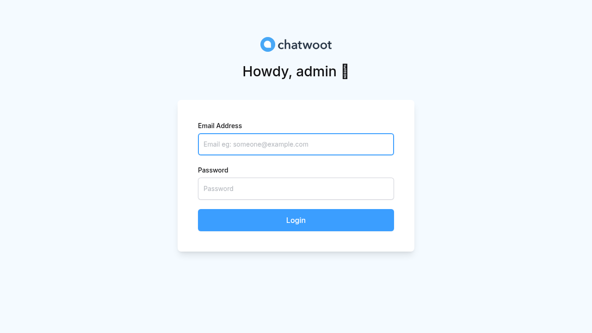
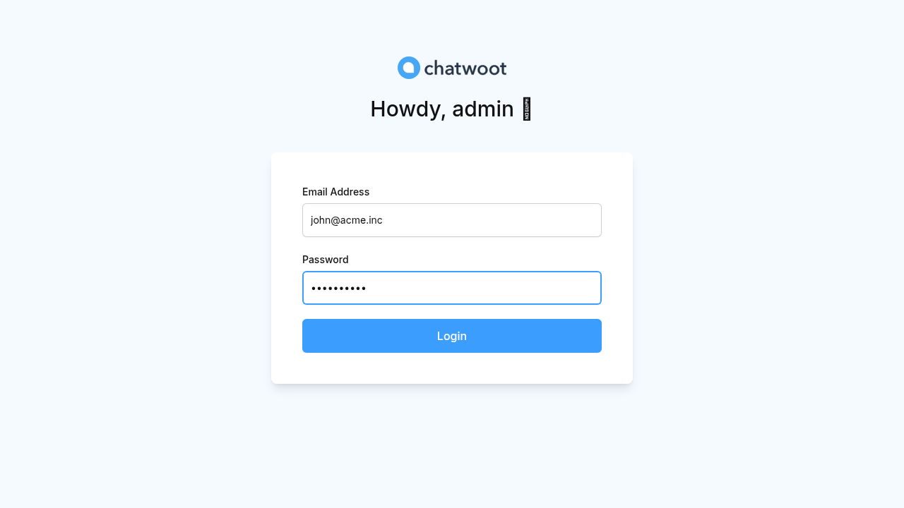
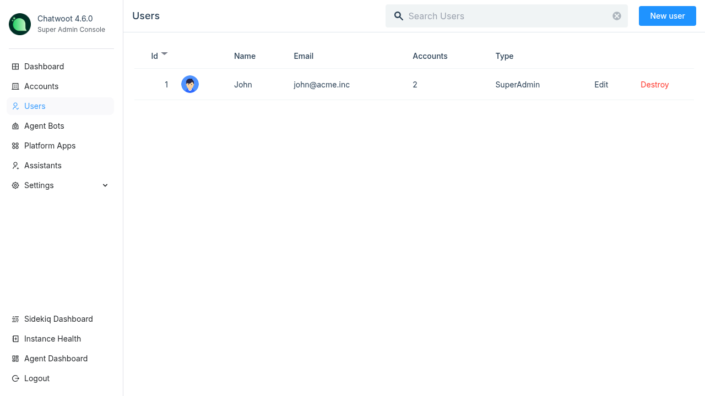

# Claude Sandbox Browser E2E – Login Flow

Screenshots captured by Claude Code using `agent-browser` against the local Chatwoot instance.

## 01 – Login Page

The super admin sign-in page at `/super_admin/sign_in`.

## 02 – Filled Login Form

Email and password fields filled in, before clicking **Login**.

## 03 – Super Admin Home

The super admin dashboard after successful authentication.
